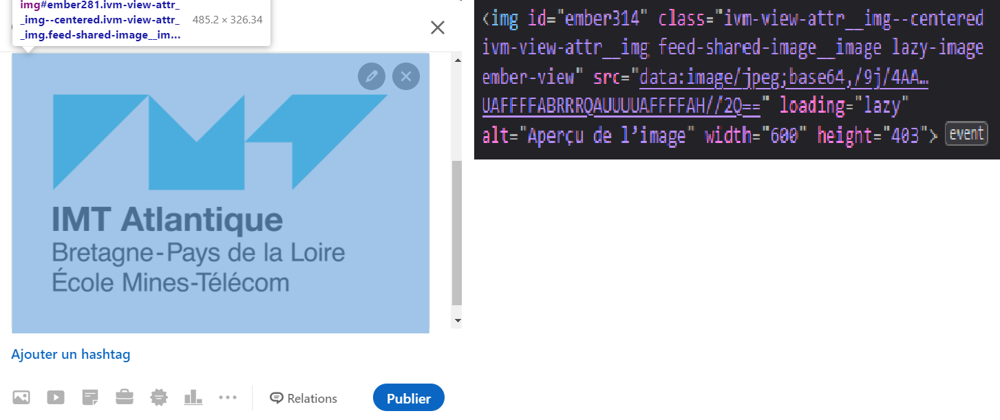

# Documentation pour l'extension Keep Control of Your Data

- L'extension fonctionne uniquement sur le navigateur **google chrome**

## Installation

Afin d'utiliser l'extension au sein d'un navigateur google chrome il faut :

- Ouvrir chrome et se rendre à l'url chrome://extensions/`
- Activer le mode de développement
- Choisir *'Load unpacked'*
- Puis sélectionner le dossier où sont présent tous les codes de l'extension (Le dossier où est présent ce readme)


## Utilisation

- Afin d'utiliser votre propre service pour stocker vos données personnelles il faut changer l'url présente dans le fichier `content_script-2`
  ```javascript
  let settings = {
    // This url need to be changed to your own self storage
    "url": "...",
    "method": "POST",
    "timeout": 0,
    "processData": false,
    "mimeType": "multipart/form-data",
    "contentType": false,
    "data": form,
    "async": false
  };
  ```
- Afin d'activer le code permettant le principe ISE, il faut clicker sur le logo de l'extension avant d'envoyer le formulaire à intercepter


## Explication des différents fichiers

Les fichiers standards dans le développement d'extension ne seront pas réexpliqué ici (notamment le manifest)

### `content_script-1.js`

Ce content script implémente le principe Récupération-Affichage, actuellement il peut traiter :

- Les balises `<e-img>`, `<e-txt>` et partiellement les balises `<e-vid>`.
- Les images étant des qrcode et contenant un lien vers une ressource distante.

### `background.js`

Ce script permet d'injecter notre `content_script-2.js` afin d'intercepter les formulaires

### `content_script-2.js`

Ce script implémente le principe Interception-Stockage-Envoi, il permet de stocker les données de l'utilisateur sur le serveur défini puis de générer les fausse données qui sont renvoyées au service.

## Current state of the extension

The extension works for posts containing texts and/or images. It does NOT work for video files or other formats.
LinkedIn posts, LinkedIn profile picture and Facebook posts are supported. The extension currently does not work on Twitter. Other websites were not tested.

Displaying data already encoded by this extension should work on any website. Data encoding does not rely on the website browsed. The limiting point relates to the data interception.

## In-depth explanation

### Interception

The data is intercepted in the post creation form.
- For text components, the user needs to select the text to encode and choose an option in the right-click menu. We use the [chrome.contextMenus](https://developer.chrome.com/docs/extensions/reference/contextMenus/), which gives two important informations: the selected text, and the DOM element clicked.

- For images, we intercept the data just after it is uploaded in the post creation form. Image selection on a website typically goes through 3 steps:
  1) The user clicks on a 'Upload file' button.
  2) A file picker opens.
  3) The user selects an image and clicks on 'Open'

After this last step, the path of the selected image is stored in a `<input type="file">` HTML tag on the page, and a `onchange` event is triggered on the input element. This event uses the submitted image and triggers several site-dependent scripts, which are hard to replicate.
So, the chosen solution is for the extension to attach a custom `onchange` handler on the input tag. The handler will replace the image by an encoded version, then call the original site handler, which will use the new version of the image.

Even though it might seem easy, giving priority to a newly attached handler is difficult. This will be further explained in a later section.

### Encoding

After intercepting the send data, we store it in the user's personal database. We then get a link to the data location in database and pass it to the website.
The link must be provided to the site in the same format as the intercepted data: if the site expects an image, we can't give it a text URL.
- For texts, we simply replace the selected words by the URL to the stored text in database. However, we also need to be able to tell the difference between an URL provided by our extension, and a standard URL: when decoding the page (see next section), we need to only decode the things we encoded ourselves.
Therefore, we add a unique prefix and suffix to the URL to make it distinguishable: `[KCoyD]http://url/to/the/data[/KCoyD]`.
This is done in `text_encoding.js`.
- For images, the link is encoded as a QRCode. This is done via the [QRCode library](https://www.npmjs.com/package/@nuintun/qrcode), and is implemented in `QrCode.js`.

Once the data is encoded, the user can freely submit the new post, which will now contain either a text link or a QRCode.

### Decoding

By default, other users will see the encoded post as a raw link. The extension is needed to automatically see the post itself on the site page.
When loading a web page, the extension will scan through the DOM elements and check for encoded data.
- For texts, the extension is looking for a RegEx pattern. Any text between the strings `[KCoyD]` and `[/KCoyD]` is considered as a link to an encoded text. The text is retrieved and replaces the link in the DOM element where it was found. Currently, **only `<span>` tags are checked**, which means text decoding won't work on some pages. Some options to prevent this are:
  - Scan the entire page. This would work 100% but might cause performance issues.
  - Scan all tags that can contain text: `<p>`, `<h1>` etc.

- For images, the extension will look at all the `` tags in the DOM, and try to decode the image as a QRCode. If it succeeds, the QRCode is replaced by the corresponding image in the `` element.
  
## Other solutions explored

Here is a list of different approaches that did not work, with explanations on why it didn't.
Note that the tests were carried out on LinkedIn primarily.

### Image interception

#### Image preview tag
First, we tried replacing the 'src' attribute of the `` tag where the uploaded image is displayed in the post creation form. The 'src' value is an image in base64 format, which means that the whole image is stored in the tag rather than a link to a file.



Therefore, we tried replacing it by the QRCode in the same format.
However, when the post is submitted, the change isn't taken into account, and the original image is sent instead. This hints that the uploaded image is stored somewhere else instead.

Quick note: on LinkedIn, the image is only sent to the LinkedIn servers once the post is submitted. This means that as long as the post creation form stays open, the image selected by the user is stored locally somewhere in the DOM. This isn't true for all sites though: for example on Facebook, the image is sent to the servers as soon as it is selected by the user.

#### Input tag
After some investigation, we found out that is in fact stored in a `<input type="file">` tag. This tag only becomes visible in the HTML page once the file picker opens, and hides as soon as the picker closes. However, changing the file in this tag isn't enough. On Facebook, the image is sent in database as soon at it is chosen by the user. Even on LinkedIn, something seems to happen right after submitting the image, so changing the input file later doesn't work. In fact, submitting a file triggers an `onchange` event, which does some operations on the chosen image. This is why the working solution requires to override this event.


#### HTTP requests interception
A different solution involves intercepting the image the moment it is sent on the social network's servers.
1) Listen to HTTP requests coming from the website
2) When the specific request containing the image is sent, block it
3) Retrieve the image from the request payload, then encode it.
4) Send a new request with the same headers, and put the QRCode in the payload

These steps are done using the [chrome.webRequest](https://developer.chrome.com/docs/extensions/reference/webRequest/) API
We didn't manage to make it work: the new request seems to be accepted (it returns a correct status response code), but the post isn't sent.
You can find the code on the branch `htmlrequest`.
Even if it did work, it currently looks for a specific LinkedIn URL in the headers to detect the wanted request. To make it a generic solution, it would be needed to find another way to recognize the request responsible of storing the image.

